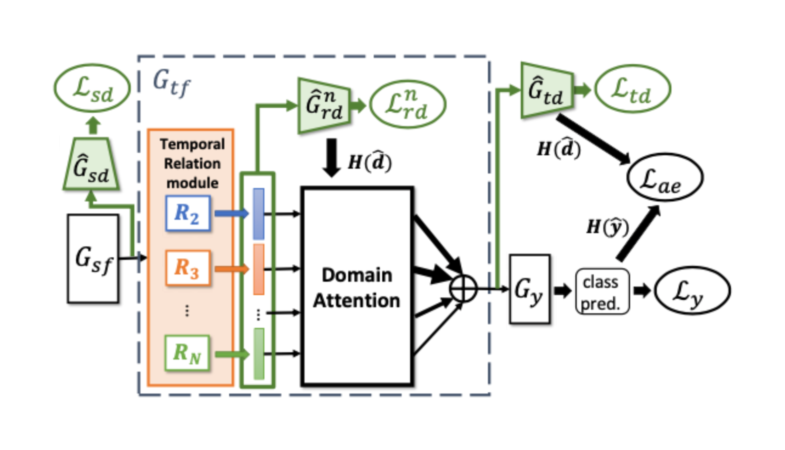
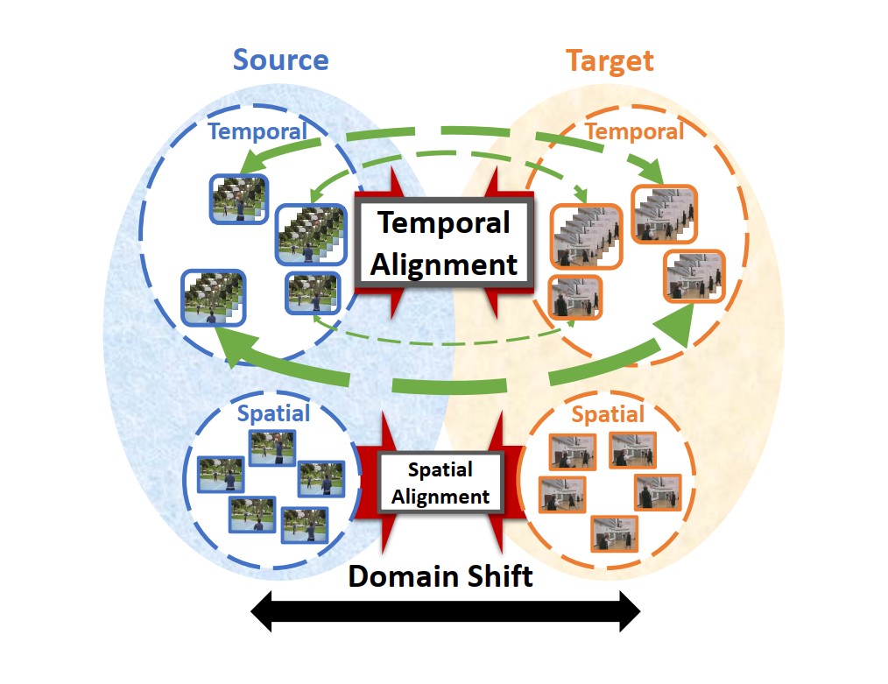

# TA3N-Lightning
This repository contains a PyTorch-Lightning inplementation of baseline Action Domain Adaptation Model TA3N. 

The code has been modified from this [repository](https://github.com/jonmun/EPIC-KITCHENS-100_UDA_TA3N), and the original TA3N code can be found [here](https://github.com/cmhungsteve/TA3N), along with its [ICCV publication](http://openaccess.thecvf.com/content_ICCV_2019/html/Chen_Temporal_Attentive_Alignment_for_Large-Scale_Video_Domain_Adaptation_ICCV_2019_paper.html).

# Original TA3N
Although various image-based domain adaptation (DA) techniques have been proposed in recent years, domain shift in videos is still not well-explored. Most works only evaluate performance on small-scale datasets which are saturated.

<p align="center">
  
  
</p>


The TA3N model chieved state-of-the-art performance of four large video DA datasets and is widely used as a baseline in many other works. Temporal Attentive Adversarial Adaptation Network (TA3N) explicitly attends to the temporal dynamics using domain discrepancy for more effective domain alignment, achieving state-of-the-art performance on four video DA datasets.

<p align="center">
  
  
</p>

# Lightning Implementation 

PyTorch Lightning is a popular deep learning framework providing a high-level interface for PyTorch, with an elegant, lightweight, hardware-agnostic design. It helps researchers to “decouple the research from the engineering” in their code, improving both reproducibility and flexibility and greatly reducing the engineering boilerplate.

In this repository, the TA3N code is modified and implemented in Pytorch-Lightning. 

### Instructions to run:

You can follow detailed instructions in the Google colaboratory notebook here:
[](https://colab.research.google.com/drive/1ZDiqTHjjaREiA9eCOJSlSARR2Dpbuqno#offline=true&sandboxMode=false)

It also has instructions on how to get the dataset used by the challenge.

---
## Acknowledgements
If you find this repository useful, please cite both the EPIC-KITCHENS dataset papers and the TA3N authors publications:

* EPIC-KITCHENS
```
@article{Damen2020RESCALING,
   title={Rescaling Egocentric Vision},
   author={Damen, Dima and Doughty, Hazel and Farinella, Giovanni Maria  and and Furnari, Antonino 
           and Ma, Jian and Kazakos, Evangelos and Moltisanti, Davide and Munro, Jonathan 
           and Perrett, Toby and Price, Will and Wray, Michael},
           journal   = {CoRR},
           volume    = {abs/2006.13256},
           year      = {2020},
           ee        = {http://arxiv.org/abs/2006.13256},
} 
@INPROCEEDINGS{Damen2018EPICKITCHENS,
   title={Scaling Egocentric Vision: The EPIC-KITCHENS Dataset},
   author={Damen, Dima and Doughty, Hazel and Farinella, Giovanni Maria  and Fidler, Sanja and
           Furnari, Antonino and Kazakos, Evangelos and Moltisanti, Davide and Munro, Jonathan
           and Perrett, Toby and Price, Will and Wray, Michael},
   booktitle={European Conference on Computer Vision (ECCV)},
   year={2018}
}
```

* Temporal Attentive Alignment
```
@article{chen2019taaan,
title={Temporal Attentive Alignment for Large-Scale Video Domain Adaptation},
author={Chen, Min-Hung and Kira, Zsolt and AlRegib, Ghassan and Yoo, Jaekwon and Chen, Ruxin and Zheng, Jian},
booktitle = {International Conference on Computer Vision (ICCV)},
year={2019},
url={https://arxiv.org/abs/1907.12743}
}

@article{chen2019temporal,
title={Temporal Attentive Alignment for Video Domain Adaptation},
author={Chen, Min-Hung and Kira, Zsolt and AlRegib, Ghassan},
booktitle = {CVPR Workshop on Learning from Unlabeled Videos},
year={2019},
url={https://arxiv.org/abs/1905.10861}
}
```
